# Batch Layer — Data Model

Entity-relationship diagram for everything under `batch/`: the 7 reference dimensions, the
7 EHR tables, the 4 claims tables, the 2 bed-capacity tables, the pharmacy inventory table,
and the SharePoint staff schedule. Streaming feeds (`stream/patient-vitals`,
`stream/prescription-events`) are out of scope — they belong to whoever owns the speed layer.

Column names, types and keys are taken directly from `DATA-CONTRACT.md` §5, which is the
binding source-of-truth for Bronze. If this diagram and that document ever disagree, trust
`DATA-CONTRACT.md` and fix this file.

## Notes on how to read it

- **PK** = primary/natural key of the row. Several tables have a **composite** key (e.g.
  `claim_line` is keyed on `patient_control_number` + `line_control_number`) — both columns
  are marked `PK` in that case.
- **FK** = foreign key to another table's PK/AK.
- **UK** = unique/alternate key, not the chosen PK (e.g. `dim_staff.npi`).
- A relationship drawn `||--o|` means the child side is **optional and at most one** — e.g.
  an `ehr_encounters` row has *at most one* matching `ehr_admissions` row, only if it was an
  inpatient stay. `||--o{` means optional-and-many.
- Two things are marked in this file even though `DATA-CONTRACT.md` doesn't state them as a
  formal PK: `ehr_diagnoses` (natural grain is `encounter_id` + `seq_num`) and `staff_schedule`
  (natural grain is `staff_id` + `work_date` + `shift`). `claims/remit` has **no stated PK** —
  a claim can receive more than one remittance (partial payments), so don't assume 1:1 with
  `claim_header`.
- The SharePoint workbook's real headers (`Facility ID`, `Work Date`, `Shift Start`, …) are
  snake_cased below (`facility_id`, `work_date`, `shift_start`, …) for diagram readability —
  the actual file has Title Case headers with spaces, starting on **row 5**.

```mermaid
erDiagram
    %% ===================== Reference dimensions =====================
    dim_facility {
        string facility_id PK
        string facility_name
        string facility_type
        string region
        string city
        string state
        string zip
        string county
        boolean emergency_services
        int licensed_beds
        int staffed_beds
        string ownership
    }

    dim_unit {
        string unit_id PK
        string facility_id FK
        string unit_code
        string unit_name
        string unit_type
        string building
        int floor
        int licensed_beds
        int staffed_beds
        int blocked_beds
        decimal nurse_patient_ratio_target
        boolean is_critical_care
        boolean is_monitored
    }

    dim_staff {
        string staff_id PK
        string npi UK
        string first_name
        string last_name
        string job_code
        string job_title
        string credential
        string primary_facility_id FK
        string primary_unit_id FK
        int employment_type
        decimal fte
        date hire_date
        date termination_date
        boolean is_active
    }

    dim_payer {
        string payer_id PK
        string payer_name
        string payer_type
        string claim_filing_indicator_code
        decimal share
        int prompt_pay_days
    }

    dim_drug {
        int rxcui_scd PK
        int rxcui_in
        string ndc11 UK
        string product_ndc UK
        string gtin14 UK
        string proprietary_name
        string non_proprietary_name
        string dosage_form_name
        string route_name
        string pharm_classes
        string dea_schedule
        int dea_drug_code
        boolean is_controlled
        string labeler_name
        decimal unit_cost
        decimal usage_weight
        boolean is_shortage_prone
        boolean is_high_alert
        string ndc_source
        string abc_class
    }

    dim_icd10 {
        string icd10_code PK
        string icd10_description
        int icd_version
        string code_chapter
        string diagnosis_category
        string care_setting
        string hrrp_cohort
        boolean is_chronic
        string readmission_risk_level
        decimal relative_frequency
    }

    dim_drg {
        string drg_code PK
        string drg_description
        decimal relative_weight
        string severity_tier
        string drg_family
        string drg_type
        string weight_source
    }

    %% ===================== EHR clinical core =====================
    ehr_patients {
        uuid Id PK
        date BirthDate
        date DeathDate
        string SSN
        string Drivers
        string Passport
        string Prefix
        string First
        string Middle
        string Last
        string Suffix
        string Maiden
        string Marital
        string Race
        string Ethnicity
        string Gender
        string BirthPlace
        string Address
        string City
        string State
        string County
        int fips_county_code
        string Zip
        decimal Lat
        decimal Lon
        decimal Healthcare_Expenses
        decimal Healthcare_Coverage
        string Income
        string phone
        string email
        boolean is_high_risk
        string mrn UK
        string source_facility_id FK
    }

    ehr_encounters {
        string Id PK
        timestamp Start
        timestamp Stop
        string Patient FK
        string Organization FK
        string Provider FK
        string Payer FK
        string EncounterClass
        string Code
        string Description
        decimal Base_Encounter_Cost
        string Total_Claim_Cost
        string Payer_Coverage
        string ReasonCode
        string ReasonDescription
        string facility_id FK
        string unit_id FK
        string encounter_class_code
        string encounter_status
        string patient_class
        string mrn FK
        string source_system
    }

    ehr_admissions {
        uuid subject_id FK
        string hadm_id PK
        timestamp admittime
        timestamp dischtime
        timestamp deathtime
        string admission_type
        string admit_provider_id FK
        string admission_location
        string discharge_location
        string insurance
        string language
        string marital_status
        string race
        timestamp edregtime
        timestamp edouttime
        boolean hospital_expire_flag
        string facility_id FK
        string admission_type_code
        timestamp admit_decision_time
        string hospital_service
        boolean transferred_in_within_6h
        boolean is_readmission
        boolean is_planned_readmission
        string index_encounter_id FK
        string encounter_id FK
        string drg_code FK
        string source_system
    }

    ehr_ed_stays {
        uuid subject_id FK
        string stay_id PK
        string encounter_id FK
        string hadm_id FK
        timestamp intime
        timestamp outtime
        string gender
        string race
        string arrival_transport
        string disposition
        decimal temperature
        string heartrate
        int resprate
        string o2sat
        string sbp
        int dbp
        int pain
        int acuity
        string chiefcomplaint
        timestamp triage_time
        timestamp provider_seen_time
        timestamp admit_decision_time
        string facility_id FK
        string source_system
    }

    ehr_outpatient_visits {
        string visit_id PK
        string encounter_id FK
        uuid subject_id FK
        string facility_id FK
        string unit_id FK
        string clinic_type
        timestamp appointment_time
        timestamp arrival_time
        timestamp provider_seen_time
        timestamp departure_time
        string seen_by_provider_id FK
        string visit_status
        boolean is_no_show
        boolean escalated_to_inpatient
        string primary_diagnosis_code FK
        string payer_id FK
        string mrn
        string source_system
    }

    ehr_diagnoses {
        uuid subject_id FK
        string hadm_id FK
        string encounter_id PK,FK
        int seq_num PK
        string icd_code FK
        int icd_version
        string icd_title
        string hrrp_cohort
        string facility_id FK
    }

    ehr_transfers {
        uuid subject_id FK
        string hadm_id FK
        string transfer_id PK
        string eventtype
        string careunit
        timestamp intime
        timestamp outtime
        string facility_id FK
        string unit_id FK
    }

    %% ===================== Billing & claims =====================
    claim_header {
        string patient_control_number PK
        string encounter_id FK
        string hadm_id FK
        uuid subject_id FK
        string facility_id FK
        decimal total_charge_amount
        string claim_filing_indicator_code
        string payer_id FK
        string payer_name
        string type_of_bill
        timestamp statement_date_from
        timestamp statement_date_to
        timestamp admission_date_and_hour
        timestamp discharge_time
        string admission_type_code
        string admission_source_code
        string patient_status_code
        string drg_code FK
        string principal_diagnosis FK
        string admitting_diagnosis
        string other_diagnoses
        string attending_provider_npi FK
        string medical_record_number FK
        string prior_authorization_number
        date submission_date
        boolean is_readmission_related
    }

    claim_line {
        string patient_control_number PK,FK
        string line_control_number PK
        string revenue_code
        string revenue_code_description
        string procedure_code
        string procedure_code_qualifier
        string procedure_description
        decimal line_charge_amount
        string unit_type
        int unit_count
        decimal non_covered_amount
        timestamp service_date_from
        timestamp service_date_to
    }

    remit {
        string patient_control_number FK
        string payer_id FK
        string claim_status_code
        string claim_status_description
        decimal total_claim_charge_amount
        decimal claim_payment_amount
        decimal patient_responsibility_amount
        string payer_claim_control_number UK
        string drg_code FK
        decimal drg_weight
        string check_eft_trace_number
        string payment_method_code
        date check_date
        date remit_date
        boolean is_appealed
        boolean is_overturned_on_appeal
    }

    remit_adjustment {
        string patient_control_number PK,FK
        int adjustment_seq PK
        string group_code
        string group_code_description
        string reason_code
        string reason_code_description
        decimal amount
        string quantity
        string remark_code
        string remark_code_description
        boolean is_denial
    }

    %% ===================== Bed capacity =====================
    bed_snapshot_hourly {
        timestamp snapshot_datetime PK
        string facility_id FK
        string unit_id PK,FK
        string unit_code FK
        int licensed_beds
        string staffed_beds
        int blocked_beds
        string occupied_beds
        string available_beds
        int pending_admissions
        boolean pending_discharges
        decimal occupancy_rate
        boolean is_at_capacity
    }

    bed_capacity_nhsn_weekly {
        string nhsn_org_id PK,FK
        string facility_name
        date week_ending_date PK
        date collection_date
        int all_hospital_inpatient_beds
        int all_hospital_inpatient_occupancy
        int all_adult_inpatient_beds
        int all_adult_inpatient_occupancy
        int all_pediatric_inpatient_beds
        int all_pediatric_inpatient_occupancy
        int all_icu_beds
        int all_icu_bed_occupancy
        int adult_icu_beds
        int adult_icu_bed_occupancy
        int pediatric_icu_beds
        int pediatric_icu_bed_occupancy
    }

    %% ===================== Pharmacy =====================
    pharmacy_inventory {
        date snapshot_date PK
        timestamp counting_datetime
        string count_type
        string facility_id PK,FK
        string location_id
        string ndc11 PK,FK
        string product_ndc
        string gtin14
        int rxcui_scd FK
        string drug_name
        string dosage_form_name
        string route_name
        string pharm_classes
        string lot_number
        date expiration_date
        string qty_on_hand
        string base_unit
        int qty_on_order
        string par_level
        int reorder_point
        int safety_stock
        decimal avg_daily_usage_30d
        decimal days_on_hand
        string abc_class
        boolean is_controlled
        string dea_schedule
        boolean is_high_alert
        string shortage_status
        string shortage_reason
        string unit_cost
        decimal extended_value
        int last_count_variance
        boolean is_stockout
        date last_restocked_at
    }

    %% ===================== Staff rostering (SharePoint XLSX) =====================
    staff_schedule {
        string facility_id PK,FK
        string unit
        string unit_code FK
        string work_date PK
        string shift PK
        string shift_start
        string shift_end
        string staff_id PK,FK
        string name
        string job_code
        int employment_type
        int scheduled_hours
        decimal actual_hours
        string status
        string overtime
        string called_out
        string floated_in
        int census
        string notes
    }

    %% ===================== Relationships =====================
    dim_facility ||--o{ dim_unit               : "has"
    dim_facility ||--o{ dim_staff               : "employs (home facility)"
    dim_unit     ||--o{ dim_staff               : "home unit of"

    dim_facility ||--o{ ehr_patients            : "sourced at"
    dim_facility ||--o{ ehr_encounters          : "occurs at"
    dim_unit     ||--o{ ehr_encounters          : "occurs in"
    dim_staff    ||--o{ ehr_encounters          : "provider on"
    dim_payer    ||--o{ ehr_encounters          : "payer on"
    ehr_patients ||--o{ ehr_encounters          : "has"

    ehr_patients   ||--o{ ehr_admissions        : "admitted as"
    dim_facility   ||--o{ ehr_admissions        : "occurs at"
    dim_staff      ||--o{ ehr_admissions        : "admitting provider"
    dim_drg        ||--o{ ehr_admissions        : "grouped as"
    ehr_encounters ||--o| ehr_admissions        : "inpatient encounter is"

    ehr_patients   ||--o{ ehr_ed_stays          : "has"
    dim_facility   ||--o{ ehr_ed_stays          : "occurs at"
    ehr_encounters ||--o| ehr_ed_stays          : "ED encounter is"
    ehr_admissions ||--o| ehr_ed_stays          : "admits from"

    ehr_patients   ||--o{ ehr_outpatient_visits : "has"
    dim_facility   ||--o{ ehr_outpatient_visits : "occurs at"
    dim_unit       ||--o{ ehr_outpatient_visits : "occurs in"
    dim_staff      ||--o{ ehr_outpatient_visits : "seen by"
    dim_payer      ||--o{ ehr_outpatient_visits : "payer on"
    dim_icd10      ||--o{ ehr_outpatient_visits : "diagnosed as"
    ehr_encounters ||--o| ehr_outpatient_visits : "outpatient encounter is"

    ehr_patients   ||--o{ ehr_diagnoses         : "diagnosed with"
    ehr_encounters ||--o{ ehr_diagnoses         : "coded with"
    ehr_admissions ||--o{ ehr_diagnoses         : "coded with (inpatient subset)"
    dim_icd10      ||--o{ ehr_diagnoses         : "resolves"
    dim_facility   ||--o{ ehr_diagnoses         : "occurs at"

    ehr_patients   ||--o{ ehr_transfers         : "moves"
    ehr_admissions ||--o{ ehr_transfers         : "moves through"
    dim_unit       ||--o{ ehr_transfers         : "moves into"
    dim_facility   ||--o{ ehr_transfers         : "occurs at"

    ehr_encounters ||--o| claim_header          : "billed as"
    ehr_admissions ||--o| claim_header          : "bills stay"
    ehr_patients   ||--o{ claim_header          : "billed for"
    dim_facility   ||--o{ claim_header          : "billed by"
    dim_payer      ||--o{ claim_header          : "billed to"
    dim_staff      ||--o{ claim_header          : "attended by"
    dim_drg        ||--o{ claim_header          : "grouped as"

    claim_header ||--o{ claim_line              : "itemized by"
    claim_header ||--o{ remit                   : "remitted via"
    dim_payer    ||--o{ remit                   : "remits from"
    remit        ||--o{ remit_adjustment        : "adjusted by"

    dim_facility ||--o{ bed_snapshot_hourly       : "measured at"
    dim_unit     ||--o{ bed_snapshot_hourly       : "measured in"
    dim_facility ||--o{ bed_capacity_nhsn_weekly  : "reported by"

    dim_facility ||--o{ pharmacy_inventory      : "stocked at"
    dim_drug     ||--o{ pharmacy_inventory      : "counted as"

    dim_facility ||--o{ staff_schedule          : "rostered at"
    dim_unit     ||--o{ staff_schedule          : "rostered in"
    dim_staff    ||--o{ staff_schedule          : "rostered as"
```

## Cadence groups (for scheduling the batch layer)

| Cadence | Tables |
|---|---|
| Daily | `ehr_patients`, `ehr_encounters`, `ehr_admissions`, `ehr_ed_stays`, `ehr_outpatient_visits`, `ehr_diagnoses`, `ehr_transfers`, `claim_header`, `claim_line`, `remit`, `remit_adjustment` |
| Daily snapshot | `pharmacy_inventory` |
| Hourly (batched into one daily file) | `bed_snapshot_hourly` |
| Weekly | `bed_capacity_nhsn_weekly`, `staff_schedule` (Monday, per facility) |
| Day 0 + every Monday (full refresh, SCD-2 candidate — `dim_staff` changes between snapshots) | `dim_facility`, `dim_unit`, `dim_staff`, `dim_payer`, `dim_drug`, `dim_icd10`, `dim_drg` |

See `DATA-CONTRACT.md` §3 for the full landing/cadence contract, §7–8 for null-rate and
injected-defect details per column, and §2 for client-vocabulary → schema-name mapping.
